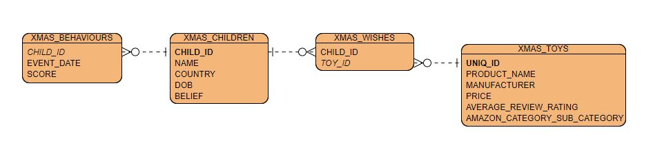

# SQLClause_Is_Coming
A set of data and questions for a Christmas themed SQL challenge

```
    |,\/,| |[_' |[_]) |[_]) \\//
    ||\/|| |[_, ||'\, ||'\,  ||

            ___ __ __ ____  __  __  ____  _  _    __    __
           // ' |[_]| |[_]) || ((_' '||' |,\/,|  //\\  ((_'
           \\_, |[']| ||'\, || ,_))  ||  ||\/|| //``\\ ,_))
                                                               

                                         ,;7,
                                       _ ||:|,
                     _,---,_           )\'  '|
                   .'_.-.,_ '.         ',')  j
                  /,'   ___}  \        _/   /
      .,         ,1  .''  =\ _.''.   ,`';_ |
    .'  \        (.'T ~, (' ) ',.'  /     ';',
    \   .\(\O/)_. \ (    _Z-'`>--, .'',      ;
     \  |   I  _|._>;--'`,-j-'    ;    ',  .'
    __\_|   _.'.-7 ) `'-' "       (      ;'
  .'.'_.'|.' .'   \ ',_           .'\   /
  | |  |.'  /      \   \          l  \ /
  | _.-'   /        '. ('._   _ ,.'   \i
,--' ---' / k  _.-,.-|__L, '-' ' ()    ;
 '._     (   ';   (    _-}             |
  / '     \   ;    ',.__;         ()   /
 /         |   ;    ; ___._._____.: :-j
|           \,__',-' ____: :_____.: :-\
|               F :   .  ' '        ,  L
',             J  |   ;             j  |
  \            |  |    L            |  J
   ;         .-F  |    ;           J    L
    \___,---' J'--:    j,---,___   |_   |
              |   |'--' L       '--| '-'|
               '.,L     |----.__   j.__.'
                | '----'   |,   '-'  }
                j         / ('-----';
               { "---'--;'  }       |
               |        |   '.----,.'
               ',.__.__.'    |=, _/
                |     /      |    '.
                |'= -x       L___   '--,
                L   __\          '-----'
                 '.____)             _/
```
## Data
The data is a mix of randomly generated data and the dataset of toys sourced from this [Kaggle Dataset](https://www.kaggle.com/PromptCloudHQ/toy-products-on-amazon). The ERD is as follows:

Scripts to create the tables (without the primary/foreign key constraints) are available in the `.sql` file and the data itself is in `.csv`s in `xmas_wishes.zip`.

## Questions

1) 


Time to make your list and check it twice, this question is all about who is naughty and who is nice! The table XMAS_BEHAVIOURS contains every event for children over the few years, and the score for that behaviour (negative is bad). Santa evaluates children on their behaviour from Midnight December 1st last year to 23:59:59 on November 30th this year (this is so he has time to get all the toys made, so when your parents told you to be good in December for Santa it is actually already too late). Use this table to find how many children this year are nice (total score greater than or equal to 0, scores are aggregated by adding them together) so Santa knows how many children he has to deliver toys to. 

2)


Ho, Ho, Hold on! Some of these children are too young to make a wish to Santa, and some of these are quite old, Santa needs you to make sure they believe enough in Christmas to still get their presents from him. No children under 3 years old on Christmas morning will get any presents (their parents clearly wrote the letter), if they are 10 or older on Christmas morning then they need a belief of at least 70% to still get their presents, and if they are 15 or older they need a belief of at least 90% to still get their wish! Using the XMAS_CHILDREN table, how many nice children are left for Santa to spread Christmas cheer to once you take this into account?

3)


Santa can't grant wishes like world peace and only you can spread joy through your Christmas spirit, which means Santa has to get the toys for all the children. The table XMAS_WISHES contains all children wishes for this Christmas, and XMAS_TOYS contains a list of all the toys anyone could wish for (which looks suspiciously like a dataset from amazon, but his elves just use that for reference when making the toys!). Only nice children get their wishes granted, and because 2020 has been such a poor year Santa is going to grant all of the remaining nice children's wishes. The wishes he won't grant are those in the "Sex & Sensuality" category (for obvious reasons) or in the "Sandwich Spreads, Pates & Pastes" sub-category (because importing spreads is a customs nightmare). Finally, Santa won't grant any wishes for products that have less than 4 out of 5 stars. If Santa didn't have all his magical elves, how much would it cost to buy all of the allowed wishes for the nice children?

4) 


Unfortunately Santa doesn't qualify for the furlough scheme and he doesn't have work for 364 days of the year! It's been a tough year for Christmas cheer, and he runs a business so even he isn't above outsourcing the work to giant corporates. If he did purchase the toys at the price in the XMAS_TOYS table he thinks he could get a 5% discount for any manufacturer he is buying 50 or more products from; if he got this how much would it cost instead (rounded to the nearest pence)?

5) 


What is your favourite Christmas song? Put it on now, turn up the volume, and spread some Christmas cheer! 
